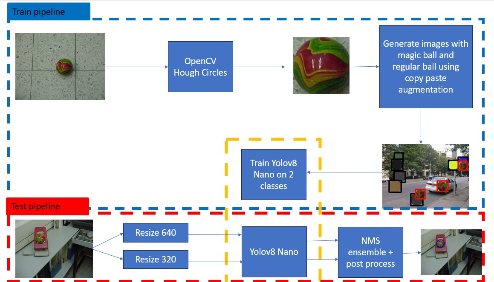
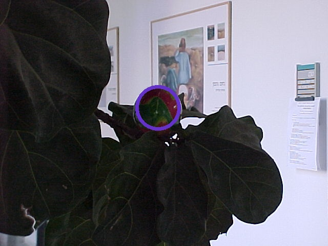
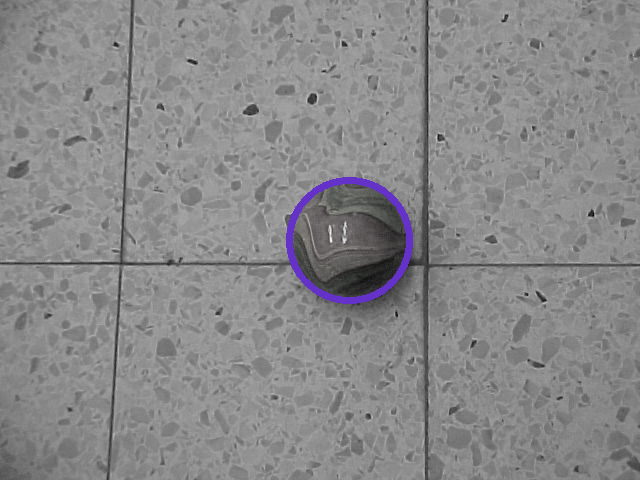

# Magic balls
* Full code and report - code_report.ipynb \ code_report.html
# Overall Strategy


The main idea was to make a model as simple as possible without the complication of preprocessing or postprocessing. For training the model, I used only one image of a ball which I found using a simple OpenCV function. After this, I pasted the same ball onto background photos I took from Kaggle. I divided the ball into 2 classes: magic-ball and a fixed color circle/ball. There are other wide-ranging possibilities to perform the task, but I chose this way because, in my understanding, it is the fastest (as you can see, it takes me an average of 70 ms per image) and requires minimum time for pre- and post-processing.

* Step 1 - I chose a simple image and using HoughCircles (OpenCV) found the magic ball.
* Step 2 - Using copy-paste augmentation, I created a new dataset.
* Step 3 - I trained a YOLOv8-nano detector to find 2 classes (0: magic ball, 1: regular ball).
* Step 4 - For inference, I used scale TTA and NMS for ensemble.
* Step 5 - For postprocessing, I converted the bounding boxes to circles.

# Datastes and requirements
```
kaggle datasets download -d balraj98/stanford-background-dataset & unzip stanford-background-dataset -d stanford-background-dataset
pip install -U ultralytics
pip install torch==1.8.1+cu111 torchvision==0.9.1+cu111 torchaudio==0.8.1 -f https://download.pytorch.org/whl/torch_stable.html
pip install numpy opencv-python 
pip install ensemble-boxes
```
# Conclusions
* According to the plot above, you can see that all the magic balls were found, and no other ball was identified as a magic ball.
* Apart from one image (MVC-008F.JPG), the bounding box around the magic ball is pretty accurate.



* The model handles a manipulated image well (bonus).



* The average processing time for one image is 70 milliseconds, while the whole test set of images took 1.12 seconds to process.

  
