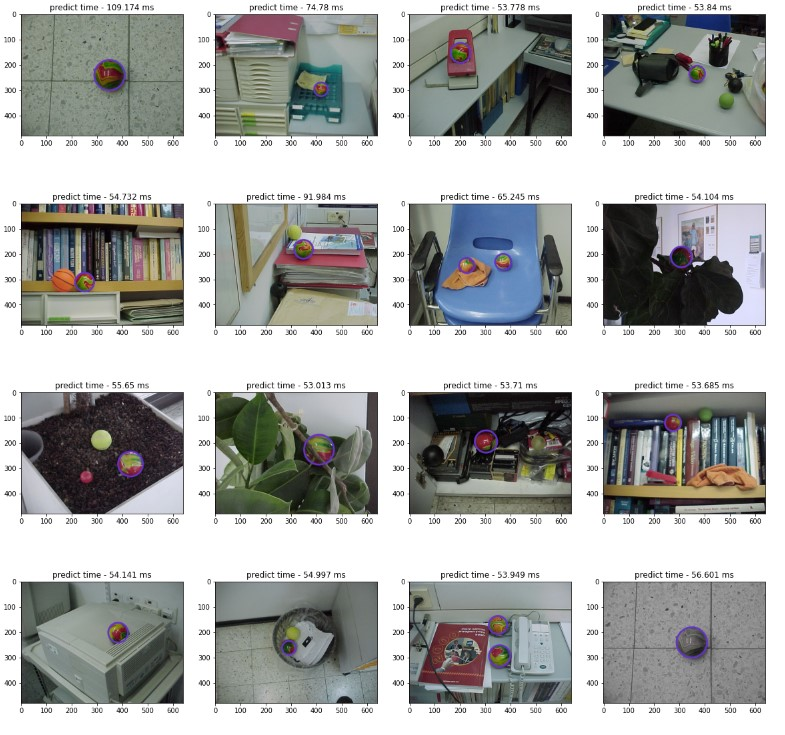

# Magic balls
* Full code and report - code_report.ipynb \ code_report.html
# Overall Strategy


The main idea was to make a model as simple as possible without the added complication of heavy preprocessing or postprocessing.

For training the model, I used only one image of a ball which I found using a simple OpenCV function.
After this, I pasted the same ball onto background photos I took from Kaggle.
I divided the ball into 2 classes: magic-ball and a fixed color circle/ball.

There are other wide-ranging possibilities to perform the task, but I chose this way because, in my understanding, it gives the fastest real-time inference (as you can see, it takes me an average of 70 ms per image) and requires minimal time for pre- and post-processing.

* Step 1 - I chose a simple image with only one magic ball and detected it using HoughCircles (OpenCV).
* Step 2 - I created a new dataset using the copy-paste augmentation.
* Step 3 - I trained a YOLOv8-nano detector to find 2 classes (0: magic ball, 1: regular ball).
* Step 4 - For inference, I used scale TTA and NMS for ensemble.
* Step 5 - For postprocessing, I converted the bounding boxes to circles.

# Datastes and requirements
```
kaggle datasets download -d balraj98/stanford-background-dataset & unzip stanford-background-dataset -d stanford-background-dataset
pip install -U ultralytics
pip install torch==1.8.1+cu111 torchvision==0.9.1+cu111 torchaudio==0.8.1 -f https://download.pytorch.org/whl/torch_stable.html
pip install numpy opencv-python 
pip install ensemble-boxes
```
# Results

# Conclusions
* According to the plot above, you can see that all the magic balls were found, and no other ball was identified as a magic ball.
* Apart from one image (MVC-008F.JPG), the bounding box around the magic ball is pretty accurate.


* The model handles a manipulated image well (bonus).


* The average processing time for one image is 70 milliseconds, while the whole test set of images took 1.12 seconds to process.
* It is possible to improve the performance dramatically and also make the model better for additional examples by retraining and creating new data using the results of the model (pseudo-labeling). However, I didn't do this because I have no way to measure the quality of the model after this process, as I don't have any more test pictures.
  
